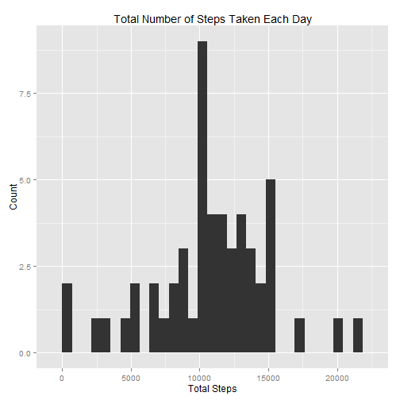
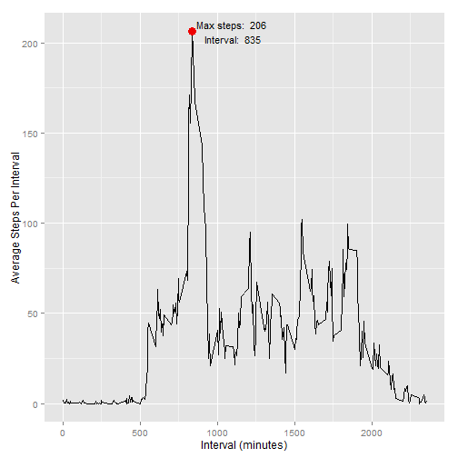
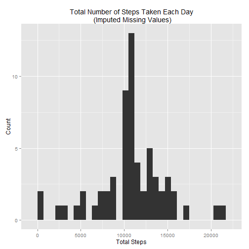
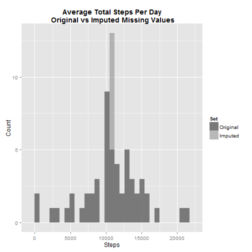
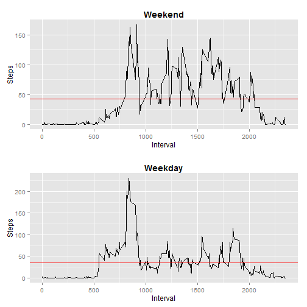

# Coursera Reproducible Research: Peer Assessment 1
## Introduction
It is now possible to collect a large amount of data about personal movement using activity monitoring devices such as a Fitbit, Nike Fuelband, or Jawbone Up. These type of devices are part of the "quantified self" movement - a group of enthusiasts who take measurements about themselves regularly to improve their health, to find patterns in their behavior, or because they are tech geeks. But these data remain under-utilized both because the raw data are hard to obtain and there is a lack of statistical methods and software for processing and interpreting the data.

This analysis uses data from a personal activity monitoring device. The device collects data at 5 minute intervals throughout the day. The data consists of two months of data from an anonymous individual collected during the months of October and November, 2012 and include the number of steps taken in 5 minutes intervals each day. The following code and analysis will provide a brief analysis of the times and days that people are most active.

## Loading data and packages
This code assumes you have the packages used below the raw data is located in your working directory.

```r
library(ggplot2)
library(gridExtra)
dir <- getwd()
data <- read.csv(file.path(dir, "activity.csv"))
```

## Total steps per day
The total number of steps recorded each day is stored in the `totalStepsPerDay` variable and represented in the histogram below:

```r
totalStepsPerDay <- aggregate(steps ~ date, data = data[!is.na(data$steps), ], FUN = sum)
qplot(x = totalStepsPerDay$steps, geom = "histogram", xlab = "Total Steps", ylab = "Count", bindwidth = 700, main = "Total Number of Steps Taken Each Day")
```

 

The mean and median total steps each day are:

```r
mean(totalStepsPerDay$steps) # Return the average amount of steps taken each day.
```

```
## [1] 10766
```

```r
median(totalStepsPerDay$steps) # Return the median amount of steps taken each day.
```

```
## [1] 10765
```

## Average daily activity pattern
The average amount of steps taken at each 5 minute time interval is calculated and stored in the variable `avgStepsPerInterval` below. The average level of activity at each time interval can be seen in the chart below.

```r
avgStepsPerInterval <- aggregate(steps ~ interval, data = data[!is.na(data$steps), ], FUN = mean)
mostSteps <- max(avgStepsPerInterval$steps)
mostStepsInterval <- avgStepsPerInterval[avgStepsPerInterval$steps == mostSteps, 1]
qplot(x = avgStepsPerInterval$interval, 
      y = avgStepsPerInterval$steps, 
      geom = "line", 
      xlab = "Interval (minutes)",
      ylab = "Average Steps Per Interval") + 
      geom_point(data = data.frame(mostStepsInterval, mostSteps), 
                 aes(mostStepsInterval, mostSteps), 
                 colour = "red2", 
                 size = 4) + 
      annotate("text", 
               label = paste("Max steps: ", 
                             round(mostSteps, 0), 
                             "\nInterval: ",
                             mostStepsInterval), 
               x = mostStepsInterval + 265, 
               y = mostSteps, 
               size = 4)
```

 

Interval 835 has the maximum amount of steps on average, as shown by the red dot on the plot above.


## Imputing missing values
There are 2304 instances of missing values in the activity dataset. These missing values have been imputed by using the average steps for each time interval calculated above and stored in `avgStepsPerInterval`. The average number of steps taken for a given time interval has been used to represent the amount of steps taken wherever there was a missing value in the original dataset for that time interval. The new imputed dataset is stored in `complete` which is assembled in the code below.


```r
nrow(data) - sum(complete.cases(data)) # Calculate the number of records with missing values.
```

```
## [1] 2304
```

```r
imputedVals <- merge(data[is.na(data$steps), ], 
                     avgStepsPerInterval, 
                     by = "interval")[, c(4, 3, 1)]
colnames(imputedVals) <- colnames(data)
cleanOrigData <- data[!is.na(data$steps), ]
complete <- rbind(imputedVals, cleanOrigData)
```

The following histogram represents the total steps taken per day after the imputed values have been take into account.


```r
totalStepsPerDayImputed <- aggregate(steps ~ date, data = complete, FUN = sum)
qplot(x = totalStepsPerDayImputed$steps, geom = "histogram", xlab = "Total Steps", ylab = "Count", binwidth = 700, main = "Total Number of Steps Taken Each Day\n (Imputed Missing Values)")
```

 

The following histogram shows the change between the original chart above and the total steps per day with the missing values imputed. The dark region represents the original data and the lighter region represents the change caused by the imputed data.


```r
totalStepsPerDay$Set <- as.factor("Original")
totalStepsPerDayImputed$Set <- as.factor("Imputed")
graphData <- rbind(totalStepsPerDay, totalStepsPerDayImputed)
ggplot(graphData, aes(steps, fill = Set)) + 
  geom_histogram(alpha = 0.5, position = "identity", binwidth = 700) + 
  scale_fill_manual(values = c(Imputed = "grey50", Original = "black")) +
  xlab("Steps") +
  ylab("Count") +
  ggtitle("Average Total Steps Per Day\n Original vs Imputed Missing Values") +
  theme(plot.title = element_text(face = "bold", size = "14"))
```

 

The impact can also be seen by comparing the means and medians of each dataset:

```r
mean(totalStepsPerDay$steps) # Mean total steps using the original data
```

```
## [1] 10766
```

```r
median(totalStepsPerDay$steps) # Median total steps using the original data
```

```
## [1] 10765
```

```r
mean(totalStepsPerDayImputed$steps) # Mean total steps using the imputed data
```

```
## [1] 10766
```

```r
median(totalStepsPerDayImputed$steps) # Median total steps using the imputed data
```

```
## [1] 10766
```
The impact of this imputation is 0 for the mean. The median is slightly higher after the imputation and matches the value of the means for both datasets. Despite the negligible impact on mean and median, the total number of steps taken on days with lots of missing values is higher.

## Differences in activity patterns between weekdays and weekends
First, a function is created to return whether or not a date is a weekend or weekday then applied it to the `complete` dataset.

```r
isWeekend <- function(x) {
  if (weekdays(as.Date(x)) %in% c("Saturday", "Sunday")) {
    return ("Weekend")
    } else return ("Weekday")
}
complete$is_weekend <- as.factor(sapply(as.Date(complete$date, "%Y-%m-%d"), FUN = isWeekend))
complete <- complete[order(complete$interval), ]
weekendData <- aggregate(steps ~ interval, data = complete[complete$is_weekend == "Weekend", ], FUN = mean)
weekdayData <- aggregate(steps ~ interval, data = complete[complete$is_weekend == "Weekday", ], FUN = mean)
```

A panel plot of the weekend and weekday data are generated to visualize how the activity levels differ.

```r
weekendPlot <- qplot(x = weekendData$interval,
                     y = weekendData$steps,
                     geom = "line",
                     xlab = "Interval",
                     ylab = "Steps",
                     main = "Weekend") +
                     theme(plot.title = element_text(face = "bold", size = "14")) +
                     geom_hline(yintercept = mean(weekendData$steps), colour = "red")
weekdayPlot <- qplot(x = weekdayData$interval,
                     y = weekdayData$steps,
                     geom = "line",
                     xlab = "Interval",
                     ylab = "Steps",
                     main = "Weekday") +
                     theme(plot.title = element_text(face = "bold", size = "14")) +
                     geom_hline(yintercept = mean(weekdayData$steps), colour = "red")
grid.arrange(weekendPlot, weekdayPlot, nrow = 2)
```

 

As shown by the plots above, people are generally more active on weekends. The main activity during weekdays spikes early in the day. This can also be represented by comparing the average activity levels for weekends and weekdays, as represented by the red horizontal lines in the charts above.

```r
mean(weekendData$steps) # Return the average steps taken on weekends.
```

```
## [1] 42.37
```

```r
mean(weekdayData$steps) # Return the average steps taken on weekdays.
```

```
## [1] 35.61
```
